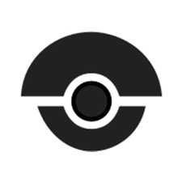

# CxDroneCI  

## Checkmarx Drone CI Integration via YML (CLI)

It is possible to run a Checkmarx Scan using the YML file of Drone CI (https://cloud.drone.io/) and take advantage of CLI as well.

## Custom Environment Varibles

First you need to configure the Drone CI Environment Variables, as you can see below:

| Variable Name  | Variable Value (Example) |
| ------------- | ------------- |
| CX_SERVER | https://checkmarx.company.com  |
| CX_USER | admin@cx  |
| CX_PASSWORD | ******** (secured)  |
| CX_TEAM | \CxServer\SP\Company\TeamA  |
| CX_PRESET | Checkmarx Default  |
| CX_HIGH | 0 |
| CX_MEDIUM | 0 |
| CX_LOW | 0 |

## Drone CI Default Environment Variables Used

| Variable Name  | Description |
| ------------- | ------------- |
| DRONE_REPO | Project Name  |
| DRONE_BRANCH | Branch Name |
| DRONE_WORKSPACE | Source Code Folder Path |
| DRONE_COMMIT | Commit SHA1 Hash  |

To use a environment variable you need to call it like this in YML:

$ENV_VAR

## Config

Then, please add to your repository source code a file called **".drone.yml"** with following configuration for Checkmarx Scan:

```yml
kind: pipeline
type: docker
name: cxscan

steps:
- name: Run Checkmarx Scan
  image: openjdk:11.0.5
  commands:
    - wget -O ~/cxcli.zip https://download.checkmarx.com/8.9.0/Plugins/CxConsolePlugin-8.90.0.zip 
    - unzip ~/cxcli.zip -d ~/cxcli 
    - rm -rf ~/cxcli.zip 
    - chmod +x ~/cxcli/runCxConsole.sh
    - export CX_PROJECT_NAME=$(basename "$DRONE_REPO")
    - ~/cxcli/runCxConsole.sh Scan -CxServer $CX_SERVER -CxUser $CX_USER -CxPassword $CX_PASSWORD -ProjectName "$CX_TEAM$CX_PROJECT_NAME-$DRONE_BRANCH" -preset "$CX_PRESET" -LocationType folder -LocationPath $DRONE_WORKSPACE -SASTHigh $CX_HIGH -SASTMedium $CX_MEDIUM -SASTLow $CX_LOW -ReportXML results-$CX_PROJECT_NAME-$DRONE_BRANCH.xml -ReportPDF results-$CX_PROJECT_NAME-$DRONE_BRANCH.pdf -Comment "git $DRONE_BRANCH@$DRONE_COMMIT" -verbose
  environment:
    CX_SERVER: https://cxprivatecloud.checkmarx.net
    CX_USER: Miguel.Freitas@checkmarx.com
    CX_TEAM: \\CxServer\\SP\\EMEA\\__psteam\\
    CX_PRESET: Checkmarx Default
    CX_HIGH: 0
    CX_MEDIUM: 0
    CX_LOW: 0
    CX_PASSWORD:
      from_secret: cx_password
```
